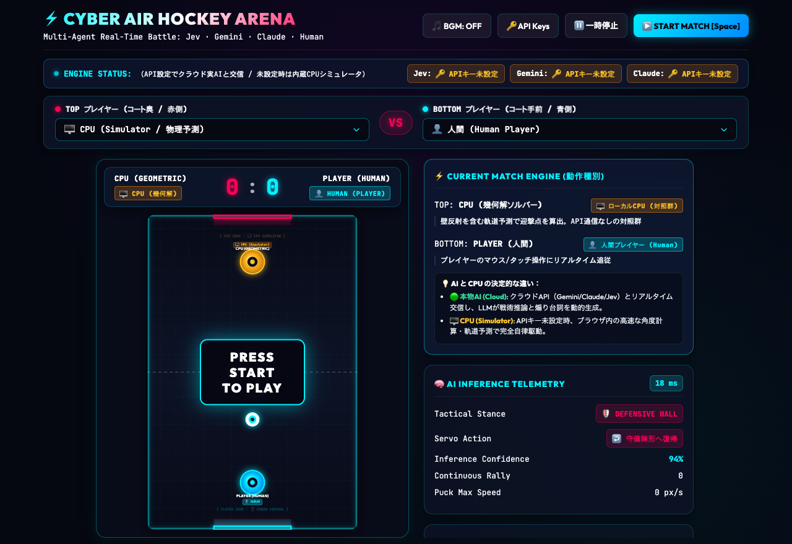
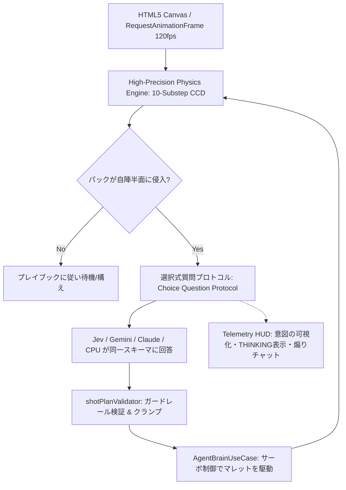
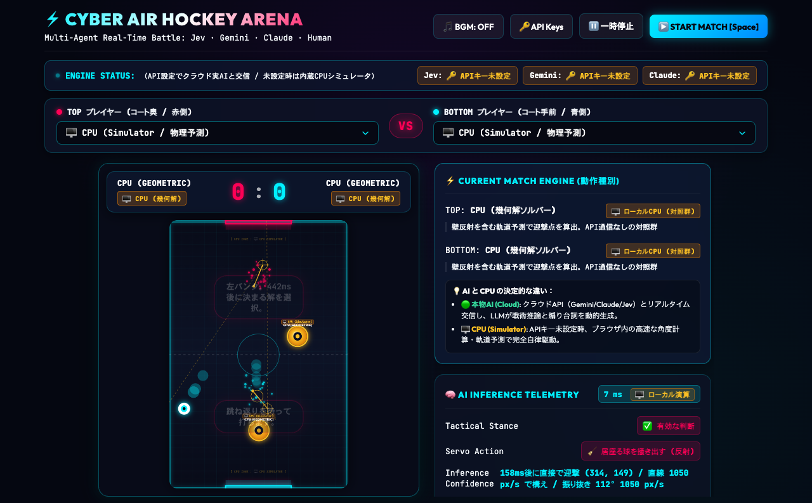

# [Jev/Gemini/Claude]エアホッケー最強決定戦

## はじめに

直感型意思決定モデル **Jev（System One）** と、熟慮型LLM **Gemini / Claude（System Two）**。
ミリ秒単位の反射速度が求められる実時間物理空間「エアホッケー」において、最強のAIはどれなのか？
同一の条件で3大AIエージェントを激突させたトーナメントの記録です。

- **リポジトリ**: [df-yamashitamasashi/jev_blog (articles/05/jev-air-hockey)](https://github.com/df-yamashitamasashi/jev_blog/tree/main/articles/05/jev-air-hockey)



---

## 前提

- **Jev/Gemini/Claudeで戦わせるために、特別なエアホッケーを開発**:
  120fpsの高速物理エンジンと、全AIが同一の選択肢（接触点・狙い先・経路・速度・パワー）から答える公平な「選択式質問プロトコル」を独自開発。
- **通信の問題を解消するため、試合前の作戦タイムと中央線上での予測タイムを用意**:
  試合前に20通りの状況への打ち手を提出させる「作戦タイム（プレイブック）」と、パックが中央線を越えた瞬間に時計を止めて通信遅延差を無効化する「予測タイム（思考バジェット125ms固定）」を導入。
- **トーナメントにはCPUも参加するが、順位はAIだけで決定**:
  理論上の基準値として決定論的ソルバーの「CPU」も参戦しますが、順位付けは純粋なAI（Gemini / Claude / Jev）の3者間で行います。

---

## 試合結果

総当たり戦（各カード複数試合、目標得点3、最大ラリー100）をフェアタイミング方式で実施しました。
AI最強の座を争う3者の順位は以下の通りです。

### 🏆 AI順位
- 🥇 **1位：GEMINI (gemini-3.6-flash)**
  - **成績**: 2勝1敗0分（AI間対決は全勝、得失点 6-2）
  - **総評**: 卓越した空間認識力とゴールポストの隙間を的確に突くアタックが炸裂。失敗率（42%）の高さという脆さを抱えながらも、要所での決定力で他を圧倒し、見事AI部門の初代王者に輝きました。
- 🥈 **2位：CLAUDE (Claude 3.5 Haiku / Haiku 4.5, effort: low)**
  - **成績**: 1勝2敗0分（得失点 4-7）
  - **総評**: 失敗率0%、狙い誤差28.4°という驚異的な堅牢性を発揮。論理的でブレのない守備と手堅いラリーを展開したものの、Geminiの爆発的な攻めに一歩及ばず惜しくも2位。
- 🥉 **3位：JEV (System One)**
  - **成績**: 0勝3敗0分（得失点 2-9）
  - **総評**: パック軌道の先読み（予測誤差14px）はCPUの13pxに肉薄し、GeminiやClaudeを凌駕。しかし、捉えた後の振り抜き方向の精度（狙い誤差44.8°）に課題を残し、得点に結びつけられず3位となりました。

*(参考記録: 幾何ソルバー CPU は 3勝0敗0分・得失点 7-1 で堂々の総合トップ。数式直結の壁の厚さを見せつけました)*

### 📊 詳細スタッツ一覧

| 順位 | エージェント | 種別 | 成績(勝-敗-分) | 得失点 | セーブ率 | 失敗率 | 予測誤差 | 狙い誤差 | 平均遅延 |
| :---: | :--- | :---: | :---: | :---: | :---: | :---: | :---: | :---: | :---: |
| - | **CPU (GEOMETRIC)** | 基準 | 3-0-0 | 7-1 | 100% | 0% | 13px | 9.9° | 2ms |
| 🥇 1位 | **GEMINI** (3.6 Flash) | AI | 2-1-0 | 6-2 | 81% | 42% | 21px | 45.9° | 13,005ms |
| 🥈 2位 | **CLAUDE** (Haiku) | AI | 1-2-0 | 4-7 | 78% | 0% | 24px | 28.4° | 1,246ms |
| 🥉 3位 | **JEV** (System One) | AI | 0-3-0 | 2-9 | 74% | 0% | 14px | 44.8° | 299ms |

---

## 速度

意思決定における「レスポンス速度（平均レイテンシ）」で比較すると、試合結果とはまったく正反対の劇的な結果が浮かび上がります。

### ⚡ 意思決定速度ランキング（AI部門）
- 🚀 **1位：JEV (System One) — 299ms**
  - Claudeの**4倍以上**、Geminiの**約43倍**という異次元の瞬発力を記録。「System One（直感）」の看板に偽りなし。
- ⏱️ **2位：CLAUDE (Haiku) — 1,246ms (約1.2秒)**
  - 構造化出力や推論を挟みながらも、クラウドLLMとして極めて実用的な1秒前後の高速レスポンスを維持。
- 🐢 **3位：GEMINI (3.6 Flash) — 13,005ms (約13秒)**
  - 試合結果では1位だったものの、1回の判断に約13秒を要しました。今回は「思考バジェット（時計停止）」ルールがあったため勝利できましたが、リアルタイムの人間対戦では致命的となる課題が浮き彫りになりました。

*(参考記録: CPU はローカル計算のため 2ms)*

### 💡 速度と強さの考察
今回のトーナメントは「通信速度に左右されないフェアな判断力」を測るために時計を止める設計にしました。そのためGeminiが勝利を収めましたが、**「時計を止めないリアルタイムの実戦空間（人間との対戦など）」では、299msで打ち返すJevの独壇場**になります。
「熟慮に時間をかけて高精度な一手を打つSystem Two」か、「ミリ秒で反射し手数を稼ぐSystem One」か——用途に応じた明確な適性が実証されました。

---

## 技術情報、詳細など

本対戦システムを支えるアーキテクチャ、物理幾何学、および対戦を白熱させるためのアルゴリズムを解説します。

### 1. 全体アーキテクチャ：物理ループ × 非同期エージェント推論

エアホッケーにおけるAI制御の最大の難所は、「パックが猛スピードで飛び交う高速物理シミュレーション」と「非同期で遅延の大きいLLM推論」の調和です。本システムでは**戦術判断（何をするか）**と**サーボ制御（どう体を動かすか）**を厳密に分離しています。



- **Domain層**: 物理数理、軌道予測、迎撃ソルバー、戦術評価など、純粋なロジック
- **Adapters層**: 各社LLMクライアント（構造化出力）、CPUシミュレータ、APIキー管理
- **Usecases層**: 物理積分エンジン、思考バジェット管理、サーボ運動制御、トーナメント進行
- **Presentation層**: Canvas描画、AI意図の投影HUD、設定モーダル

### 2. 意思決定の核心：共通「選択式質問」プロトコル

全エージェントには、1回の判断につき以下の5問が提示されます（`choiceQuestions.ts`）。

| 質問名 | 内容 | 選択肢の形式 |
| :--- | :--- | :--- |
| `contact` | 予測軌道上の**いつ・どこで**当てるか | サンプリングされた候補地点（例:「320ms後、(300, 210)」） |
| `aim` | どこへ打ち返すか | `GOAL_LEFT/CENTER/RIGHT`, `BANK_LEFT/RIGHT`, `CLEAR` 等 |
| `path` | 構え位置へのアプローチ経路 | `STRAIGHT`, `CURVE_LEFT`, `CURVE_RIGHT` |
| `speed` | 移動アプローチ速度 | 450〜1050px/s の5段階（インデックス文字列） |
| `power` | インパクトの強さ | 450〜1050px/s の4段階（インデックス文字列） |

- **軌道予測の候補化**: 未来の到達点候補を物理側が事前にサンプリングして渡すため、AIは難解な2次方程式を解く必要がなく、「最も戦術的に有利なタイミング」を選ぶだけで済みます。
- **スキーマ肥大化とClaudeのHTTP 400対策**: 試合前作戦タイムでは100問のスキーマを投げるため、オブジェクト展開だとClaudeで文法コンパイルエラー（HTTP 400）が発生しました。これを「状況列挙型フィールドを持つ配列スキーマ」に一本化し、JSON Schemaを3,000文字以内に圧縮して解決しています。
- **ガードレール検証**: LLMの出力は一切信用せず、自陣を超えた座標指定や不正な速度値は `shotPlanValidator.ts` で安全域にクランプし、修正履歴をテレメトリに記録します。



### 3. 「アクティブ」な対戦を実現する仕掛け

単に「最短で強く打ち返す」ロジックだと、AI同士の対戦は**1400ラリー・425秒にわたる中央直線の打ち合い膠着状態**に陥りました。これを解決するために導入した工夫です。

1. **「相手を動かせたか」を評価する報酬関数 (`shotTactics.ts`)**:
   - 相手が0.06秒以内に追いつけるコースは「枠内シュート」止まりとして減点。
   - 相手マレットの移動距離を長く強いるコース、壁反射（バンクショット）を高評価。
2. **2次ベジェ曲線によるパック迂回アプローチ (`approachPath.ts`)**:
   - 構え位置へ最短直線で移動すると、飛来中のパックと途中で衝突してオウンゴールになる事故を防ぐため、パックの予測軌道を避けるベジェ曲線を自動生成。

### 4. サーボ制御：戦術と運動の完全分離 (`AgentBrainUseCase.ts`)

LLMが決定したショット計画をマレットに反映する際、以下の制御工学的ガードを施しています。

- **反転禁止ルール**: マレットが一度パックの横を通り過ぎた場合、急激に戻ってパックに再衝突することを禁止（過去に178度のあらぬ方向へ飛ぶバグの原因だったため）。
- **到着（Arrival）制御**: 目標地点に近づくにつれ $v = \sqrt{2 \cdot a \cdot d} \times 0.9$ で滑らかに減速し、オーバーシュートによる小刻みな振動を防止。

### 5. 予測と迎撃の幾何学 (`interception.ts`)

パックとマレットの衝突時刻 $t \in [0, 1]$ は、相対座標系における以下の2次方程式の最小正根として厳密に解析解を求めます。

$$
a t^2 + 2b t + c = 0
$$
$$
a = \|\Delta \mathbf{v}\|^2, \quad b = \Delta \mathbf{p} \cdot \Delta \mathbf{v}, \quad c = \|\Delta \mathbf{p}\|^2 - (r_A + r_B)^2
$$

また、打球の飛翔方向を決定付けるのはマレットの進行方向ではなく**接触法線ベクトル**であるため、ソルバーが最大8回の反復計算によって狙い方向へ収束する法線角度を逆算しています。

### 6. ディレクトリ構造 (Clean Architecture)

```
articles/05/jev-air-hockey/src/
├── domain/                       # 物理数理、予測、戦術評価、検証ロジック
│   ├── physics.ts                # 2Dベクトル、CCD、剛体インパルス
│   ├── puckPredictor.ts          # パック軌道予測（物理エンジンと同一計算式）
│   ├── interception.ts           # 接触法線・迎撃点ソルバー
│   ├── approachPath.ts           # ベジェ曲線による構え位置への移動経路
│   ├── shotTactics.ts            # ショット候補生成・膠着回避スコアリング
│   ├── playbook.ts               # 20状況の作戦タイム・CPUスタイル
│   └── shotPlanValidator.ts      # ガードレール検証
├── adapters/                     # 外部APIクライアント & 通信
│   ├── choiceQuestions.ts        # 選択式質問の生成
│   ├── claudeAgentClient.ts      # Claude構造化出力クライアント
│   ├── geminiAgentClient.ts      # Gemini構造化出力クライアント
│   ├── jevAgentClient.ts         # Jev APIクライアント
│   └── cpuAgentClient.ts         # ローカルCPUシミュレータ
├── usecases/                     # コアロジック
│   ├── physicsEngine.ts          # 10サブステップ積分エンジン
│   ├── agentBrainUseCase.ts      # サーボ制御
│   ├── gameLoopUseCase.ts        # 毎フレームTick・思考バジェット管理
│   └── tournamentUseCase.ts      # 総当たり戦の進行・成績集計
└── presentation/                 # 描画・UI
    ├── canvasRenderer.ts         # 意図の可視化・THINKINGネオングロー表示
    ├── telemetryHud.ts           # HUD・煽りチャット表示
    └── main.ts                   # アプリケーション起動
```

### 7. クイックスタートとテスト

```bash
# クローンとセットアップ
git clone https://github.com/df-yamashitamasashi/jev_blog.git
cd jev_blog/articles/05/jev-air-hockey
npm install

# 単体テストの実行（物理・予測・サーボ・ガードレール・トーナメント等の全テスト）
npm test

# 開発サーバー起動（ブラウザで http://localhost:5173 にアクセス）
npm run dev
```

APIキーを設定すれば各社実AI同士の対戦が、APIキーがなくても内蔵CPUシミュレータによって同じ土俵での対戦が即座に楽しめます。

---

## まとめ

今回の「エアホッケー最強決定戦」を通じて、異なる知能モデルの明確な個性とトレードオフが浮き彫りになりました。

- **Gemini**: 優れた空間把握と決定力でAI部門優勝を飾るも、レイテンシ（13秒）に課題。
- **Claude**: 失敗率0%・低誤差の安定感を誇り、手堅い戦術を展開。
- **Jev**: 299msという圧倒的な反射速度と高い軌道予測精度を誇り、リアルタイム実空間における「System One」としての大きな可能性を証明。

物理世界とリアルタイムに対峙するAIエージェントの未来は、熟慮（System Two）と直感（System One）が互いの強みを補完し合うハイブリッドな設計にあると言えます。ぜひリポジトリを手元で動かし、その熱いラリーを体験してみてください。

